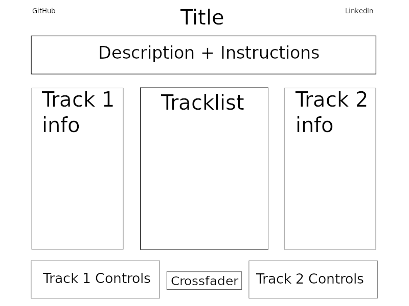

# DJ

This project implements a basic DJ setup where users transition between tracks (a.k.a. "mix" them).

## Features

- Users can change the tempo of a track to match the track it is being mixed into.
- Users can upload their own tracks through a drag and drop interface or use default tracks.

## Technology

The project will be implemented in vanilla JavaScript, HTML, and CSS. The core features will be built around the WebAudio API. I expect learning the ins and outs of WebAudio in a short period of time to be the most difficult challenge, but something that can be overcome with diligent examination of the MDN documentation.

## Wireframe

## Timeline

### Phase 1

- Style enough to match basic wireframe structure.
- Add two test tracks.
- Create unstyled but functional crossfader input.
- Display names of both files playing.

### Phase 2

- Allow ability to drag and drop tracks into tracklist.
- Allow ability to drag and drop tracks into the two track slots.
- Add keyboard shortcuts for each action.

### Phase 3

- Style everything.
- Add turntable spinning animations while a track is playing.
- Make turntable arm move towards center as a track progresses.

### Bonus

- Implement lowpass and highpass filters for each track.
- Autodetect tempo/BPM for each track and display it.