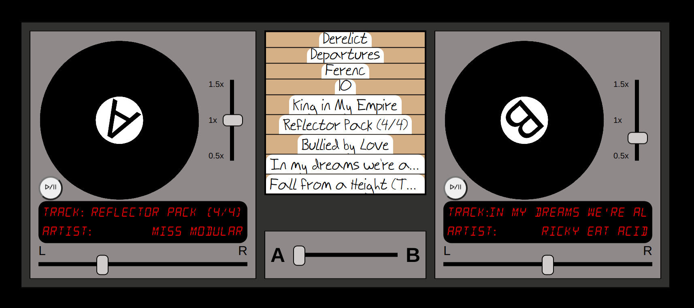

# DJ

This project implements a basic DJ setup where users transition between tracks (a.k.a. "mix" them).

[Live Link](https://tbeddy.github.io/dj/)

## Features

- Users can manually change the tempo of a track to match the track it is being mixed with.
- Tracks are represented by a revolving turntable.

## Technology

The project is implemented in vanilla JavaScript, HTML, and SCSS. The core features are built with the WebAudio API.